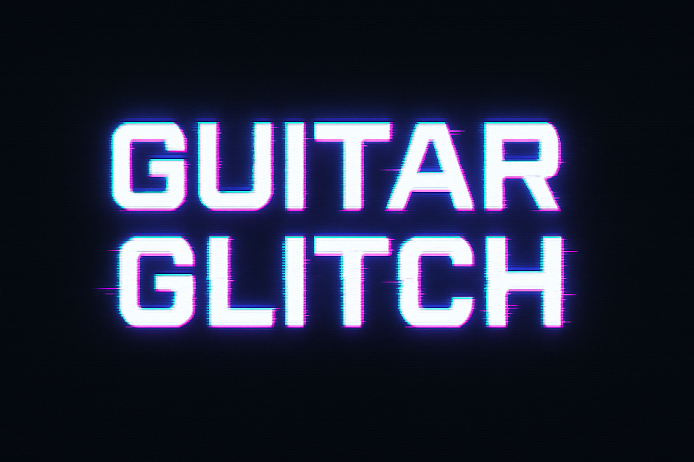
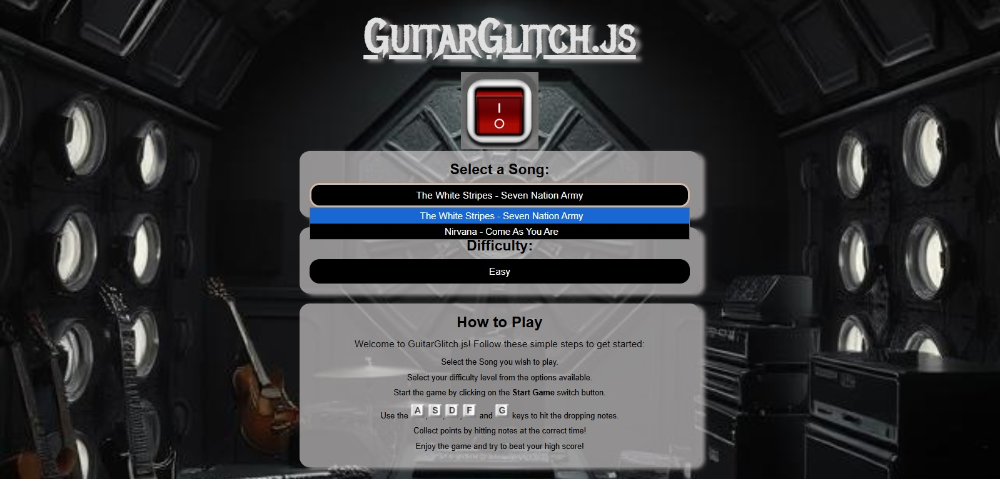
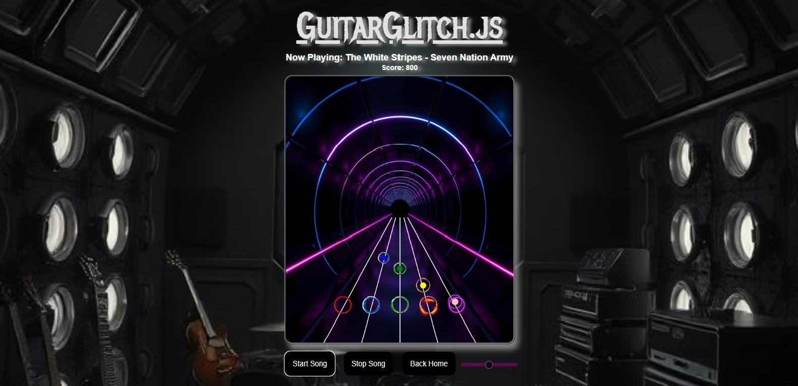
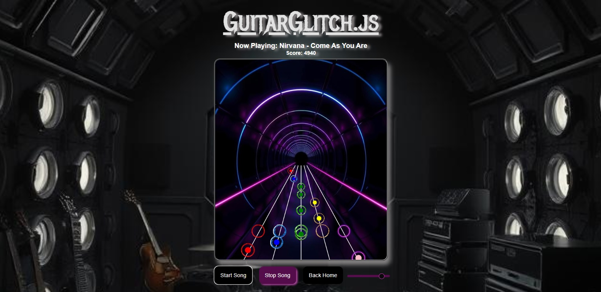

## 📑 Table of Contents
- [Short Description](#short-description)
- [Showcase](#showcase)
- [Key Features](#key-features)
- [Technologies Used](#technologies-used)
- [Challenges & Lessons Learned](#challenges--lessons-learned)
- [How to Get Started (Local Setup)](#how-to-get-started-local-setup)
- [Live Demo](#live-demo)
- [Notes](#notes)

---

## Short Description
**Guitar Glitch** is a browser-based rhythm game inspired by Guitar Hero.  
Built with **JavaScript, HTML, and CSS**, it challenges players to hit notes in time with the music using their keyboard.  

Choose your difficulty, test your timing skills, and aim for the highest score!

---

## Showcase

### Screenshots
<p align="center">
  
</p>
<p align="center">
  
</p>
<p align="center">
  
</p>

### GIF Demo


### YouTube Demo Video
[Watch the Demo on YouTube](https://youtu.be/9V_aFnm19f4)

---

## Key Features
- **Song Selection:** Play along to two available songs.  
- **Difficulty Levels:** Three modes (Easy, Medium, Hard) – higher difficulty = more accurate note patterns.  
- **Keyboard Controls:** Use your keyboard to hit the notes in rhythm.  
- **Timing System:** Points are awarded based on precision – the better the timing, the higher the score.  
- **Note Mapping:** Notes are pre-programmed with JSON and time delay for accurate synchronization.  
- **Score Feedback:** Track your performance and aim for the best possible score.  

---

## Technologies Used
- **Languages:** JavaScript, HTML, CSS  
- **Game Logic:** Custom JSON note-mapping with timing delays  
- **Audio:** Native browser audio playback  
- **Styling:** CSS (custom game UI)  

---

## Challenges & Lessons Learned
- **Rhythm Synchronization:** Learned how to synchronize visual note drops with audio playback using delays and timestamps.  
- **JSON Note Mapping:** Built a system to define and load note patterns for different songs and difficulties.  
- **Keyboard Input Handling:** Implemented precise keyboard event detection and timing windows for scoring.  
- **Game Design Balance:** Discovered how difficulty scaling impacts gameplay flow and user engagement.  

---

## How to Get Started (Local Setup)
To run this project locally, follow these steps:

1. Clone the repository:  
   ```bash
   git clone https://github.com/MarcelFelder-git/guitar-glitch
   ````

2. Navigate to the project directory:
   ```bash
   cd guitar-glitch
   ````

3. Open the project with a local server (recommended: Live Server
 in VS Code).
   - Right-click index.html → "Open with Live Server"
   
4. The application will run in your browser at:
   ```arduino
   http://localhost:5500
   ````

---

## Live Demo 
You can try out the live version of Guitar Glitch here:

[Guitar Glitch on Vercel](https://03-guitar-glitch.vercel.app/)

---


## Notes
This project was created as part of my **Frontend Developer training at Cimdata**.  
The main focus was on JavaScript game logic, timing precision, and JSON-based note mapping.
Further improvements could include additional songs, expanded difficulty settings, and advanced animations.

### Future Improvements
- Add additional songs  
- Expand difficulty settings  
- Implement advanced animations  
- Explore mobile support (e.g., touch controls or on-screen buttons)  

### Known Bugs
- **Audio Delay on First Start:** The audio may start slightly delayed on the very first run because the file isn’t fully loaded. After the first start, everything remains in sync.  

> Currently, the game is **keyboard-only** and **not optimized for mobile devices**.
